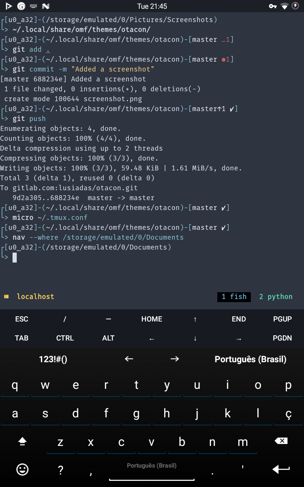

[](/LICENSE)
[](https://fishshell.com)
[](https://www.github.com/oh-my-fish/oh-my-fish)

# otacon

> A theme for [Oh My Fish](https://www.github.com/oh-my-fish/oh-my-fish)

A simplified version of the [fox](https://github.com/Posnet/fish-theme) theme, optimized to display information adjusted to the terminal length, with an accompaning status bar theme for [tmux](https://tmux.github.io).



## Install

```fish
omf repositories add https://gitlab.com/argonautica/argonautica
omf install otacon
```
